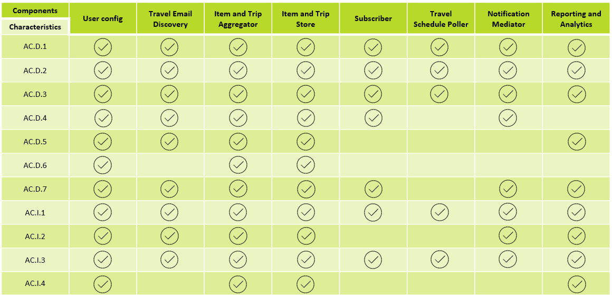

# O'Reilly Architectural KAtas Challenge Fall 2023 - Team Onion Submission

This is a github space for the Architectural Katas Challenge Fall 2023 - Team Onion Elimination Round submission

Team Members:  
[Bas Bartelink](https://www.linkedin.com/in/basbartelink/)  
[Mart Brouwer](https://www.linkedin.com/in/mart-brouwer/)  
[Kees van Dolderen](https://www.linkedin.com/in/kees-van-dolderen/)  
[Guilbert Payusan](https://www.linkedin.com/in/guilbert-magtuto-payusan-914a3985/)  
[Karol Skrzymowski](https://www.linkedin.com/in/karolskrzymowski/)  

## Contents

1. [Glossary](#glossary)  
2. [Problem Background](#problem-background)  
    - [Introduction](#introduction)  
    - [Requirements](#requirements)  
    - [Additional Context](#additional-context)  
3. [Strategy and Vision](#strategy-and-vision)  
    - [Vision](#vision)
    - [Goals](#goals)
    - [Opportunities](#opportunities)
4. [Constraints and Assumptions](#constraints-and-assumptions)  
    - [Technical Constraints](#technical-constraints)  
    - [Assumptions](#assumptions)
5. [Architectural Principles](#architectural_principles)  
6. [Architectural Characteristics](#architectural-characteristics)  
    - [Driving Characteristics](#driving-characteristics)  
    - [Implicit Characteristics](#implicit-characteristics)  
7. [Architectural Decision Records](#architectural-decision-records)  
8. [Architecture Views](#architecture-view)  
    - [Logical View](#logical-view)
    - [Physical View](#physical-view)
9. [Components Overview](#components-overview)  
    - [API Management](#api-management)
    - [Push Notification Service](#push-notofication-seervice)
    - [User Config](#user-config)
    - [Items and Trip Aggregator and Store](#items-and-trip-aggregator-and-store)
    - [Travel Email Discovery](#travel-email-discovery)
    - [Reporting and Analytics](#reporting-and-analytics)
    - [Travel Schedule Poller](#travel-schedule-poller)
    - [Subscriber](#subscriber)
    - [Notification Mediator](#notification-mediator)
    - [Message Broker](#message-broker)
10. [Architectural Quanta](#architectural-quanta)  
11. [Infrastructure](#infrastructure)
    - [Cloud Deployment](#cloud-deployment)
    - [DevOps Pipeline](#devops-pipeline)
    - [Database Replication Consideration](#database-replication-consideration)
12.   
    -   
    -   
13.   

## Glossary

|Term|Definition|
|-|-|
| | |
| | |
| | |

## Problem Background
### Introduction
The Problem: The Road Warrior  
A new startup wants to build the next generation online trip management dashboard to allow travelers to see all of their existing reservations. Organized by trip either online (web) or through their mobile device.  
### Requirements
- Poll email looking for travel-related emails,  
- Filter and whitelist certain emails,  
- The system must interface with the agency’s existing airline, hotel, and car rental interface system to update travel details (delays, cancellations, updates, gate changes, etc.). Updates must be in the app within 5 minutes of an update (better than the competition),  
- Customers should be able to add, update, or delete existing reservations manually as well,  
- Items in the dashboard should be able to be grouped by trip, and once the trip is complete, the items should automatically be removed from the dashboard,  
- Users should also be able to share their trip information by interfacing with standard social media sites or allowing targeted people to view your trip,  
- Richest user interface possible across all deployment platforms,  
- Provide end-of-year summary reports for users with a wide range of metrics about their travel usage,  
- Road Warrior gathers analytical data from users trips for various purposes - travel trends, locations, airline and hotel vendor preferences, cancellation and update frequency, and so on,  
### Additional Context
- Must integrate seamlessly with existing travel systems (i.e, SABRE, APOLLO),  
- Must integrate with preferred travel agency for quick problem resolution (help me!)
- Must work internationally technical requirements,
### Technical Requirements
- Users must be able to access the system at all times (max 5 minutes per month of unplanned downtime),  
- Travel updates must be presented in the app within 5 minutes of generation by the source,  
- Response time from web (800ms) and mobile (First-contentful paint of under 1.4 sec) 

Users  
- 2 million active users/week, 
- total users: 15 million (user accounts)  

## Strategy and Vision

### Vision
In order to make the Business Case viable profit-wise, the Road Warrior Service is provided for free and the income is generated by selling the (anonymized) analytical data from user trips and items. Providing this data to the travel agencies will give them better insight into market shifts and customer preferences and provide services in line with those opportunities.  

Our professional expertise is in the Environmental, Social & Governance (ESG) domain. It means that factors such as energy consumption, climate, availability of raw materials, health, safety and good corporate governance are taken into account when selecting and managing shareholdings in companies.  

ESG is all about seeking a balance between financial and economic results, transparency, social interests and the environment without losing the balance between them. Contrary to popular belief, this balance appears to lead to better results for both the company and society. There is a broad consensus that ESG objectives ultimately create added value for portfolio companies, both from the perspective of risk mitigation and value creation.  

Incorporating ESG into Road Warrior gives it an edge in the Global market.  

We strive to use SaaS components and/or re-use components when it makes sense to do so.  

### Goals
- Achieve clear insight of all your trips and items within a single dashboard view.  
- To provide ESG data to external partners to provide additional value aside from the travel analytical data.  
- To use SaaS solutions when it is applicable in the Architecture.  

### Opportunities
- Use and re-use components when applicable in the Architecture.  
- Use our niche in the market to supply travel agencies with ESG valued data.  
- Further provide reports on travel trends, based on your location, occupation, travel type (business/private).  

## Constraints and Assumptions

### Assumptions
|ID|Name|Description|
|-|-|-|
|1.|Profit goal|Road Warrior service is provided for free, income generated by selling the analytical data from user trips.|
|2.|Travel Agancy|Road Warrior service is not a travel agency system, but an aggregator of user travel data from multiple sources. Because of that no reservations can be made over the Road Warrior UI or API.|
|3.|Standardized interfaces|Data sources have standardized APIs where travel systems cover a majority of service providers in different categories, but along that major service chains (like SIXT for car rental or Marriott for hotels) may have their own APIs.|
|4.|Webhooks|Standardized APIs of data sources are capable of providing webhooks methods for subscribing to asynchronous data feeds.|
|5.|Data from sources|A single source (travel agencies, travel systems, airlines, etc.) always provides new information and do not duplicate its own updates.|
|6.|Mobile apps|Mobile apps are native, not web based.|
|7.|Email Polling|Email polling is supported only with major email service providers, e.g. Google, Yahoo, Microsoft. Otherwise users will need to relay on email forwarding based on filtering.|

## Architectural Principles

|ID|Name|Description|Rationale|
|-|-|-|-|
|||||

## Architectural Characteristics

### Driving Characteristics
|ID|Name|Core|Definition|Rationale|
|-|-|-|-|-|
|AC.D.1|Security||This refers to the protection of software, data, and systems against unauthorized access, use, disclosure, disruption, modification, or destruction. It involves various measures and techniques to guard against cyber threats and vulnerabilities.|The rationale for setting security as a driving characteristic is to protect an organization's digital assets, ensure regulatory compliance, maintain business continuity and safeguard its reputation. Security architecture is essential in Road Warrior's interconnected and potentially threat-filled digital landscape to counteract a wide range of security risks and threats effectively.|
|AC.D.2|Interoperability|X|It is the ability of different software systems, devices, or applications to connect, communicate, and work together without any special effort. For software, this means being able to exchange and make use of information seamlessly with other software or systems.|Interoperability allows Road Warrior to exchange data and information efficiently with different systems and applications. This is crucial for Road Warrior as it will rely on multiple data sources / providers. Interoperability ensures that data is accessible and usable across different systems and platforms. This is especially important for Road Warrior to be able to gather analytic data and to perform useful reporting. Road Warrior should reduce dependency on single vendor's products or services where possible, preventing vendor lock-in and ensuring flexibility. Interoperable systems are scalable by design to meet growing demands as they can incorporate new components or services without major disruptions.|
|AC.D.3|Auditability||This is the capability of a system to provide a traceable record of all actions and transactions. It allows organizations to review and verify the accuracy and authenticity of operations and data, often used for regulatory compliance and for identifying potential security breaches.|Auditability as a driving characteristic is to establish a robust implementation of compliance requirements, security, accountability and to be able to manage risks effectively. It also contributes to incident detection and response, quality assurance and continuous improvement efforts.|
|AC.D.4|Performance|X|It encompasses the speed, responsiveness, and efficiency of a system. Performance can be gauged by factors like load times, throughput (rate of processing), and latency (time delay). High-performance software ensures tasks are completed without unnecessary delays.|As performance directly impacts the user experience, Road Warrior should aim for fast response times and smooth interaction leading to satisfied costumers. Customers are more likely to engage with and continue using systems that respond promptly to their actions. Slow-loading pages or unresponsive apps can lead to frustration and abandonment. Systems that require near real-time responses, such as Road Warrior, rely on high-performance architectures to ensure timely and accurate data processing. Being a data-intensive application, performance is crucial for processing large datasets efficiently and providing timely insights. Efficient performance often means better utilization of infrastructure resources, leading to energy efficiency and cost savings. Performance efficiency also often go hand-in-hand with increased reliability. Systems that are optimized for performance are less likely to experience instability or downtime due to resource exhaustion or bottlenecks.|
|AC.D.5|Usability|X|Refers to how user-friendly a software or system is. It's about designing products that are easy to use, efficient, and satisfying. Usability takes into account the user experience, which includes the design, interface, and overall interaction with the software.|A usability-focused design prioritize user needs, preferences and behaviors, leading to a more satisfying and positive user experience. Satisfied users are more likely to use and recommend Road Warrior to others leading to customer loyalty. Road Warrior should includes features that make technology more accessible to individuals with disabilities, ensuring compliance with accessibility regulations and reaching a broader user base. Road Warrior should incorporate feedback mechanisms that allow users to provide input and suggestions for improvement, contributing to iterative development and continuous enhancement.|
|AC.D.6|Portability||This is the ease with which software can be transferred from one computing environment to another. A portable software can run on different types of hardware, operating systems, or configurations without requiring significant changes.|Road Warrior should be able to run on various operating systems, devices and mobile ecosystems, expanding the potential user base maximally. Portability can lead to cost savings by enabling Road Warrior to choose the most cost-effective infrastructure or cloud services. It allows to avoid unnecessary expenses associated with proprietary or cloud vendor specific solutions. Portability allows Road Warrior to quickly adapt to changing business needs and technology trends. It enables to migrate Road Warrior and its data to a different infrastructure, cloud provider or platforms without significant disruptions, fostering business agility. In the event of a disaster or service interruption, portability allows for quick recovery by restoring Road Warrior and its data in alternative environments or locations when necessary. Portability can contribute to sustainability efforts by enabling Road Warrior to be hosted on environmentally friendly data centers or cloud providers, supporting energy-efficient practices.|
|AC.D.7|Privacy||Concerns the protection of user data and information. Software designed with privacy in mind ensures that user data is collected, stored, and processed in a manner that respects and safeguards the user's rights. This includes aspects like data encryption, anonymization, and compliance with privacy regulations.|Legal and regulatory compliance: As many countries and regions, where Road Warrior will be available, have enacted strict data protection laws and regulations, such as the European Union's General Data Protection Regulation (GDPR) and the California Consumer Privacy Act (CCPA). We need to ensure compliance with such legal requirements, avoiding potential legal and financial consequences. User rights: To warrant individuals' privacy rights, such as the right to access, correct, or delete their personal data. We need to ensure that Road Warrior has processes and/or functionality in place to handle such requests efficiently and in compliance with legal requirements. Enhancing user consent and transparency: Road Warrior needs to include mechanisms for obtaining and managing user consent for data processing activities. This also promotes transparency by providing clear and accessible privacy policies and notices, informing users about how their data is collected, used and shared.|

### Implicit Characteristics

|ID|Name|Definition|Rationale|
|-|-|-|-|
|AC.I.1|Feasibility|This refers to the practicality of implementing a particular solution or feature in software development. It considers various factors including technical constraints, available resources, time, and financial implications. When assessing feasibility, the question is: "Can this be done given our current circumstances?"|The rationale for defining feasability as a implicit characteristic is to ensure that Road Warrior as a technology project is well-informed, realistic and aligned with the strategic goals and constraints. It will help to make informed decisions about whether to proceed with the product, allocate resources effectively, manage risks and optimize technology investments.|
|AC.I.2|Legal|This relates to ensuring that the software adheres to all legal requirements and standards. This could range from licensing considerations to data protection regulations and other relevant laws. It's crucial to ensure software doesn't inadvertently violate any legal mandates.|Legal as an implicit characteristic should ensure that the development of Road Warrior and how it will be operated complies with applicable legal requirements, reducing legal risks, protecting the organization's reputation and avoiding potential legal consequences and liabilities.|
|AC.I.3|Maintainability|This is about how easily software can be modified to correct faults, improve performance, or adapt to a changing environment. A maintainable system is structured in a way that makes updates and fixes straightforward without causing disruptions or introducing new issues.|The rationale for having maintainability as an implicit characteristic is to develop Road Warrior in a cost-effective way to operate, easy to support and adaptable to changing requirements. A focus on maintainability reduces operational challenges, enhances system reliability and supports long-term sustainability.|
|AC.I.4|Accessibility|Accessibility focuses on designing software that can be used by all people, regardless of their abilities or disabilities. This means creating software that is usable by people with a wide range of physical and cognitive abilities. Accessibility considerations often include features like screen reader compatibility for the visually impaired, alternative input methods for those with motor disabilities, and clear, understandable content presentation for those with cognitive impairments. Adhering to accessibility standards not only widens the user base but also fulfills legal and ethical responsibilities in many jurisdictions.|Accessability as an implicit characteristic is to ensure that technology solutions are accessible to all individuals, regardless of their abilities or disabilities. This characteristic promotes inclusivity, legal compliance, improved user experiences, positive reputation and maybe a competitive advantage. It aligns with the ethical and corporate social responsibility principles of Roas Warrior while expanding the potential user base and fostering customer loyalty.|

## Architectural Decision Records

[001 We are using ADRs](./ADR/ADR001.md)  

[002 Utilization of Event-Driven Architecture combined with a Microservice Architecture](./ADR/ADR002.md)  

[003 Use user centric events](./ADR/ADR003.md)  

[004 Use UI specific API groups](./ADR/ADR004.md)  

[005 Utilization of SaaS solutions for use cases requireing complex systems](./ADR/ADR005.md)  

[006 Application distributed to multiple regions](./ADR/ADR006.md)

[007 Utilizing active PubSub message brokers](./ADR/ADR007.md)  

[008 User data store not replicated between regions](./ADR/ADR008.md)  

[009 Use of caching for common requests to lower latency](./ADR/ADR009.md)

[010 Data replication over different hosting regions](./ADR/ADR010.md)

## Architecture Views
### Logical View

### Physical View

## Components Overview

### API Management
### Push Notification Service
### User Config
### Items and Trip Aggregator and Store
### Travel Email Discovery
### Reporting and Analytics
### Travel Schedule Poller
### Subscriber
### Notification Mediator
### Mssage Broker

## Architectural Quanta

## Infrastructure Considerations

### Cloud Deployment 

In today's digital age, the deployment of a sophisticated application requires more than just hosting it on a server. It demands a comprehensive approach where different components of the system integrate seamlessly, scale as per demand, and remain resilient to failures. "The Road Warrior" isn't just an application; it's an intricate ecosystem of interrelated services aimed at simplifying the traveler's experience.

Azure, Microsoft's cloud platform, offers a vast array of services tailored to cater to such sophisticated systems. From databases that store crucial user data to compute resources that run the core application, Azure provides tools that can be pieced together to build robust, scalable, and efficient systems.

For "The Road Warrior", Azure isn't just a host but a foundation. Leveraging Azure's capabilities, the system aims to provide users with real-time travel updates, ensure data security, and deliver a seamless user experience, whether accessed from a desktop in New York or a mobile device in Tokyo. The deployment model for "The Road Warrior" on Azure encapsulates this vision, laying out a blueprint of how each component of the system is set up, interacts, and scales to serve huge number of travelers worldwide.

#### Database Tier:
Azure SQL Database: For user accounts, trip details, and other relational data.
Azure Cosmos DB: For NoSQL data needs, possibly for analytical data.

#### Compute Tier:
Azure App Service:
Host the main web application and backend services.
Connects to both the SQL Database and Cosmos DB.

#### Azure Functions:
Serverless functions for lightweight processing needs. (interfacing with external systems.)
Triggered based on events like new email notifications or travel updates.

#### Storage Tier:
Azure Blob Storage: Store static assets, images, and possibly large unstructured data.

#### Network & Security:
Azure Virtual Network (VNet): Create an isolated network environment. All services reside within this VNet.
Azure Application Gateway: For load balancing traffic and ensuring high availability.
Network Security Groups (NSGs): Firewall rules at the subnet level, ensuring secure traffic flow.
Azure Active Directory (AAD): For identity management and user authentication.

#### Integration Points:
External travel systems (like SABRE and APOLLO) interfacing via API connectors.
Social Media platforms for sharing capabilities.

#### Monitoring & Management:
Azure Monitor & Log Analytics: For real-time monitoring, custom dashboards, and alerts.
Azure Backup & Site Recovery: For backups and disaster recovery.

#### DevOps & CI/CD:
Azure DevOps Services: Continuous integration, continuous deployment, and version control.
Code repositories, build and release pipelines

#### Content Delivery:
Azure CDN: Cache static resources closer to users for faster load times.

#### Caching & Performance:
Azure Cache for Redis: Cache frequently accessed data for faster retrievals and reduced database load.

### DevOps Pipeline

Modern software development has evolved beyond simple code writing and deployment. Today's applications, especially complex ones like "The Road Warrior", require a streamlined process that merges the traditionally separate disciplines of software development (Dev) and IT operations (Ops). This merged approach is termed as "DevOps".

The essence of DevOps is to automate and enhance the software delivery process, ensuring rapid, reliable, and consistent deployments. It transforms the entire software life cycle, from code writing to deployment and monitoring.

Azure DevOps Services, offered by Microsoft, provides a suite of cloud-based tools that support the entire DevOps life cycle. From version control with Azure Repos, to build and release automation with Azure Pipelines, and work tracking with Azure Boards, Azure DevOps Services facilitate a seamless flow of code from development to production.

Implementing a DevOps pipeline using Azure means leveraging these tools to ensure that the travel dashboard remains agile, reliable, and consistently updated with the latest features, while minimizing downtime and errors. Through a series of automated stages, the code is integrated, tested, deployed, and monitored, allowing developers and operations teams to collaborate effectively and deliver the best experience for the users.

#### Source Control:
Start by setting up a repository in Azure Repos. You can use Git for version control.
Organize your codebase with separate branches for features, development, staging, and production.

#### Continuous Integration (CI):
Upon every code commit or pull request merge, trigger a build process.
Use Azure Pipelines to set up the CI process.
The CI process usually involves:
Fetching the latest code.
Running unit tests.
Compiling the code.
Packaging the compiled code into deployable units (like Docker containers).
Storing the deployable units in a repository, such as Azure Container Registry for Docker images.

#### Continuous Deployment (CD):
This phase is also set up using Azure Pipelines.
The CD process is triggered after a successful CI process or manually when you're ready to deploy.
Steps often include:
Fetching the deployable units from the repository.
Deploying them to a staging environment using tools like Azure Kubernetes Service (AKS) or directly to Azure App Service.
Running integration and UI tests.
If tests pass, the same deployable units are promoted to the production environment.

#### Infrastructure as Code (IaC):
Using Azure Resource Manager (ARM) templates or tools like Terraform, define the infrastructure needed for your application.
This ensures that the infrastructure can be provisioned and managed reliably and consistently.

#### Configuration Management:
Use tools like Azure Key Vault to manage secrets and configurations without exposing them in the codebase.
This ensures that sensitive data is kept secure, and configurations can be changed without altering code.

#### Monitoring & Logging:
Once deployed, use Azure Monitor and Log Analytics to gather telemetry data, logs, and set up alerts for any anomalies.
This helps in identifying issues in real time and facilitates rapid response.

#### Feedback & Iteration:
Gather feedback from the staging and production environments.
Use tools like Azure Application Insights for performance monitoring and user analytics.
Incorporate the feedback into the next development cycle, promoting a continuous feedback loop.

#### Collaboration & Communication:
Use Azure Boards for work tracking, including features, bugs, and user stories.
Ensure that the development and operations teams communicate effectively, using tools like Microsoft Teams or Slack, which can be integrated into Azure DevOps for notifications and alerts.

### Database Replication Consideration

The latency for replicating a specific table or dataset between different regions in a cloud environment, like Azure, depends on multiple factors:
- Database Type and Service: Azure offers several types of databases, such as Azure SQL Database, Azure Cosmos DB, Azure Database for MySQL, and others. Each of these databases has its own replication mechanisms and associated latencies.
- Network Latency: This depends on the distance and network route between the source and target regions.
- Data Volume: The amount of data being replicated can impact latency, especially during the initial replication.
- Transaction Volume: If the database is under heavy use, replication might be slower due to the increased transaction volume.
- Database Configuration: The configuration of the database, including indexes, triggers, and other settings, can influence replication latency.
- Service Level Agreement (SLA): Azure typically provides SLAs for many of its services, which can give you an idea of expected performance.

- Azure Cosmos DB has a multi-master model that allows for low-latency writes in multiple regions. It promises single-digit millisecond latencies for reads and writes.
https://learn.microsoft.com/en-us/azure/cosmos-db/distribute-data-globally

- Azure SQL Database Geo-Replication provides a recovery point objective (RPO) of less than 5 seconds for 99% of the time. (https://learn.microsoft.com/en-us/azure/azure-sql/database/active-geo-replication-overview?view=azuresql)

#### Azure Cosmos DB
Azure Cosmos DB promises single-digit millisecond read and write latencies at the 99th percentile. The actual latency will vary based on the chosen consistency model. Cosmos DB offers five consistency levels: Strong, Bounded staleness, Session, Consistent prefix, and Eventual. Each of these has different implications for latency and data accuracy. Multi-master replication allows for multiple write regions, which can help ensure low-latency writes no matter where the application is deployed.

#### Azure SQL Database Geo-Replication
For Azure SQL Database using Active Geo-Replication, the recovery point objective (RPO) is typically less than 5 seconds for 99% of the time. This means that in the case of a failover, typically lose less than 5 seconds worth of transactions. The recovery time objective (RTO), which is the time it takes to restore after a failure, is typically less than 30 seconds. RPO and RTO are disaster recovery metrics and are not directly measures of replication latency, but they give an idea of how quickly data is synchronized and how fast a failover can complete.
